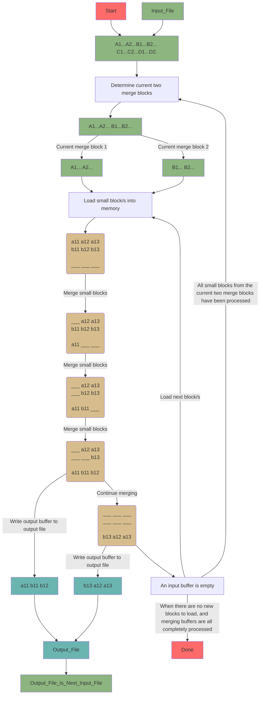
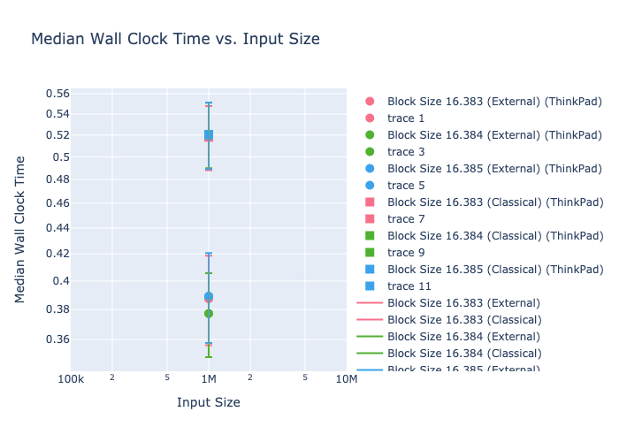
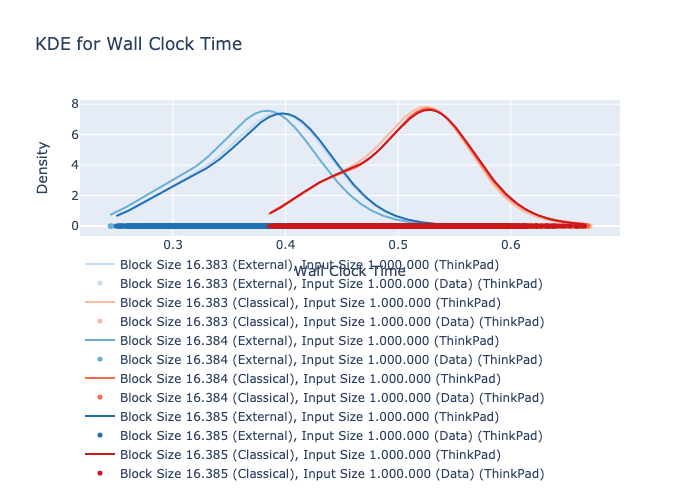

# External Memory Merge Sort

This project is a comparison of External Memory Merge Sort vs. Classical Merge Sort. 
Both implementations are single-threaded. We use $k = 2$ for the $k$-way merge in 
the External Memory Merge Sort algorithm.

## Environment Setup
We now assume that you are in the top level directory of this project.
For the `C` compiler version, we use `gcc-13 (Homebrew GCC 13.2.0) 13.2.0` on Computer1, and `gcc (GCC) 13.2.1 20230801` on Computer2. 
We use `Python 3.11.5` for data visualization. Create your Python virtual environment for this project with 
`python -m venv env_python && source env_python/bin/activate` and `pip install -r requirements.txt`.
To get out of the Python environment, `deactivate` it. 
Upgrade all packages with `pip freeze --local | grep -v '^\-e' | cut -d = -f 1 | xargs -n1 pip install -U && pip list`.

### Helpful but not required
We make use of `Chromium` to look at `html`, `svg` and `png` files for the data visualization.
Alternatively, we use an OpenSearch stack for a more comfortable visualization.

## How To Run the Code

### Testing $\leftrightarrow$ Analysis Toggle Configuration (basic)
If you want to run the tests or inspect the correct behaviour of the External Merge Sort algorithm, set 

`int do_test = 1;`

in `src/main.c`. You can use the debug flags to step through the code if you wish to do so.
  ```
  int main()
  {
      int do_test = 1;
      do_test ? test_merge_round() : perform_analysis();
      return 0;
  }
  ```

### Compilation $\rightarrow$ Execution (basic)

Compile and run the code with 
```
cd src && gcc -O3 -march=native -funroll-loops -flto -m64 -std=c11 -Wall -Wpedantic main.c classical_merge_sort.c -o ../bin/main.out && ../bin/main.out && cd ..
```

### Hypothesis Testing
Test the hypotheses about the algorithms run times, their distributions and how they are influenced by parameters like `input_size` and `block_size` by running
```
cd src && python visualization_hypothesis_test.py > ../res/hypothesis_test_results.txt && cd ..
```

### Visualization
Run the visualization without the algorithms with this line 
```
cd vis && rm *.html *.svg *.png ; cd ../src && python visualization.py && cd ../vis && chromium --new-window *.html *.svg && cd ..
```
If there are many input files on which the algorithms run, choose this one instead
```
cd vis && rm *.html *.svg *.png ; cd ../src && python visualization.py && cd ../vis && chromium --new-window visualization.html kde_plot.html && cd ..
```

#### OpenSearch Stack
It is possible to inspect the data with an OpenSearch stack. This is a flexible approach for data visualization and 
alleviates some data format configuration hurdles when compared to the Python/Plotly/Matplotlib data visualization method.

These steps are necessary in order to get the stack running:
* Start the OpenSearch cluster with `cd opensearch && docker compose up -d && cd ..`.
* Configure the data node(s) to not use SSL for the HTTP and restart the node(s).
Log into the nodes with (here Node 2 as an example) with `docker exec -it opensearch-node2 /bin/bash`. Configure the security setting and exit with the command 
`cd config && sed -i 's/plugins.security.ssl.http.enabled: true/plugins.security.ssl.http.enabled: false/' opensearch.yml && exit`.
* Then start LogStash. Use absolute paths instead for the volumes if required.  
  ```
  docker run -d --name logstash --network=opensearch_opensearch-net -v ./logstash/logstash.conf:/usr/share/logstash/pipeline/logstash.conf   -v ./logstash/logstash.yml:/usr/share/logstash/config/logstash.yml   -v ./res/:/usr/share/logstash/res/ opensearchproject/logstash-oss-with-opensearch-output-plugin:latest
  ```
* Access OpenSearch Dashboards at [http://0.0.0.0:5601/app/home](http://0.0.0.0:5601/app/home).
* Create or refresh the index pattern, of the index that LogStash uses to publish to OpenSearch, e.g., of the index `results_index`.
* Create your own visualizations and dashboards according to your needs.

### Notification
Since the experiments take a long time, there is a way to get notified when the processing is done.
For this to work, you need to set up a `.env` file with your bot token and chat id, like this:
```
BOT_TOKEN=<your_bot_token>
CHAT_ID=<your_chat_id>
```
Get notified with the algorithm analysis results as soon as the results are available.
```
cd src && python notification.py && cd ..
```

### Compilation $\rightarrow$ Execution $\rightarrow$ Notification (recommended)
Fall back to the recommended option if you are satisfied with the OpenSearch stack for the visualization and
if you do not want to configure the Python visualization or the hypothesis tests before the notification.
For the algorithm analysis in conjunction with creating the new visualization, execute this line 
```
cd src && gcc -O3 -march=native -funroll-loops -flto -m64 -std=c11 -Wall -Wpedantic main.c classical_merge_sort.c -o ../bin/main.out && ../bin/main.out && python notification.py && cd ..
```

### Compilation $\rightarrow$ Execution $\rightarrow$ Visualization
For the algorithm analysis in conjunction with creating the new visualization, execute this line 
```
cd src && gcc -O3 -march=native -funroll-loops -flto -m64 -std=c11 -Wall -Wpedantic main.c classical_merge_sort.c -o ../bin/main.out && ../bin/main.out && cd ../vis && rm *.html *.svg *.png ; cd ../src && python visualization.py && cd ../vis && chromium --new-window visualization.html kde_plot.html && cd ..
```
(given that the browser `Chromium` is installed).

### Compilation $\rightarrow$ Execution $\rightarrow$ Visualization $\rightarrow$ Notification
Use this command for the entire process. This can even be extended to include the hypothesis testing process.
```
cd src && gcc -O3 -march=native -funroll-loops -flto -m64 -std=c11 -Wall -Wpedantic main.c classical_merge_sort.c -o ../bin/main.out && ../bin/main.out && cd ../vis && rm *.html *.svg *.png ; cd ../src && python visualization.py && chromium --new-window visualization.html kde_plot.html && cd ../src && python notification.py && cd ..
```

## Hypothesis Testing
* Classical merge sort should perform better than or similar to external memory merge sort for the same 
  input sizes because it does not need any overhead
  * If it is meant that the comparison should be done with initial block_size as large as possible, then this 
    benefit should not exist or be very small because external memory merge sort would only operate
    in phase 1 and sort everything in memory using *qsort* if it is possible to do so
  * If it is meant that the comparison should be done with initial *block_size = 1*, then merge sort should 
    have a more clear advantage. In that case it should not perform worse than external memory merge sort

  $\rightarrow$ Examine run time for the input sizes (classical $\leftrightarrow$ external) with paired $t$-test

* Larger blocksizes should have better performance than small blocksizes since with larger 
  blocksizes, 
  * In phase 1, we benefit from internal sortation in greater proportion relative to I/O operations
  * In phase 2, we need less merge rounds.

  $\rightarrow$ Examine run time for all input sizes (smaller $\leftrightarrow$ larger block size) with paired $t$-test
  ($\dots H_0$: There is a significant difference, $H_1$: There is no significant difference)

* If it is meant that the comparison should be done with initial *block_size = 1*, then the number of merge rounds
  that classical merge sort needs should be the same as the number of merge rounds that external memory merge sort
  needs
* If it is meant that the comparison should be done with initial block_size as large as possible, then external memory
  merge sort should not need any merge rounds on the small input files
  $\rightarrow$ Examine number of merge rounds for the input sizes with a paired $t$-test

* The runtime of classical merge sort should scale with $O(n\cdot \log n)$.
  
  $\rightarrow$ Goodness-of-Fit test: Kolmogorov-Smirnov (KS).
* The runtime of external merge sort should scale with $O(n\cdot \log n)$.

  $\rightarrow$ Goodness-of-Fit test: Kolmogorov-Smirnov (KS).
* The number of merge rounds of classical merge sort should scale with $O(\log n)$.

  $\rightarrow$ Goodness-of-Fit test: Kolmogorov-Smirnov (KS).
* The number of merge rounds of external merge sort should scale with $O(\log n)$.

  $\rightarrow$ Goodness-of-Fit test: Kolmogorov-Smirnov (KS).

* When multiple runs are recorded for a specific combination of parameters, the runtimes are not normally distributed for large inputs. 
  Normality may hold for small inputs.

* There is a significant difference of the run times on different hardware

* There is a significant difference of the run times between using `compare_ints()` and `compare_binary()` functions for comparing the numbers

* There is no significant difference between compiling with gcc or clang

* There is a significant difference between compling with just `gcc -O3...` and with `gcc -O3 -march=native -funroll-loops -flto -m64...`

* There is a significant difference between using multiples of the underlying storage block size (`stat -f %k input.bin`/`stat -c %o input.bin` which is $4096$ on our system) for the block_size parameter
(very likely, observed in our visualization)


## Open Questions
* Multi-way merge should improve performance
* Double buffering should improve performance
* Multithreading should improve performance

## Open
* Add file seed/global, Computer1/Computer2 flags into the visualizations for better understanding of what we are looking at
* Add critical values plots to separate boxplots over, input size (or block size or $k$ if $k$-way merge implemented) on $x$ axis, with "hypothesis rejection line"
* Interpolate medians and critical values of boxplots of measured runs

## A Merge Round of the External Memory Merge Sort Algorithm
For the external memory merge sort algorithm, this behavior is repeated until the size of the partitions that are sorted exceeds or is equal to the input size. 


## Results
This is a selection of some results. More results can be found in the `res` folder and in the report.





## Author
This was done by [Vincent Uhse](mailto:vincent.uhse@uni.kn).
